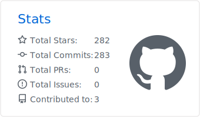
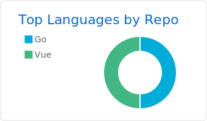

[简体中文](./README_ZH.md) &nbsp;|&nbsp; **English**

---

<!-- Typing intro -->

  

 

<!-- About -->

  🍜 A hot bowl of rice noodles, and a growing AI heart. 
  I'm an <b>AI Learner</b>, obsessed with every detail of large models, agents and real-world applications. 
  I believe "consistent input + consistent output" is the best way to grow — so this is where I keep the bugs I squashed, the code I shipped, and the little sparks along the way.

---

### 📊 Stats Dashboard

<table>
  <tr>
    <td align="center"><b>Overview</b></td>
    <td align="center"><b>Top Languages</b></td>
  </tr>
  <tr>
    <td>
      <picture>
        <source media="(prefers-color-scheme: dark)" srcset="./profile-summary-card-output/github_dark/3-stats.svg" />
        <source media="(prefers-color-scheme: light)" srcset="./profile-summary-card-output/github/3-stats.svg" />
        
      </picture>
    </td>
    <td>
      <picture>
        <source media="(prefers-color-scheme: dark)" srcset="./profile-summary-card-output/github_dark/1-repos-per-language.svg" />
        <source media="(prefers-color-scheme: light)" srcset="./profile-summary-card-output/github/1-repos-per-language.svg" />
        
      </picture>
    </td>
  </tr>
</table>

  <picture>
    <source media="(prefers-color-scheme: dark)" srcset="https://github-readme-streak-stats.herokuapp.com/?user=HotRiceNoodles&hide_border=true&background=00000000&ring=4EC9B0&fire=FF6B6B&currStreakNum=e6edf3&sideNums=9198a1&currStreakLabel=4EC9B0&dates=9198a1" />
    <source media="(prefers-color-scheme: light)" srcset="https://github-readme-streak-stats.herokuapp.com/?user=HotRiceNoodles&hide_border=true&background=00000000&ring=4EC9B0&fire=FF6B6B&currStreakNum=2f363d&sideNums=586069&currStreakLabel=4EC9B0&dates=586069" />
    
  </picture>

 

  <picture>
    <source media="(prefers-color-scheme: dark)" srcset="https://github-readme-activity-graph.vercel.app/graph?username=HotRiceNoodles&hide_border=true&area=true&bg_color=00000000&color=9198a1&line=4EC9B0&point=4EC9B0" />
    <source media="(prefers-color-scheme: light)" srcset="https://github-readme-activity-graph.vercel.app/graph?username=HotRiceNoodles&hide_border=true&area=true&bg_color=00000000&color=586069&line=4EC9B0&point=4EC9B0" />
    
  </picture>

---

### 🛠️ Tech Stack

  <b>Languages</b> 
  
  
  
  

  <b>AI / Deep Learning</b> 
  
  
  
  

  <b>Tools & Platforms</b> 
  
  
  
  

---

### 🐍 Contribution Snake

  <picture>
    <source media="(prefers-color-scheme: dark)" srcset="https://raw.githubusercontent.com/HotRiceNoodles/HotRiceNoodles/output/github-snake-dark.svg" />
    <source media="(prefers-color-scheme: light)" srcset="https://raw.githubusercontent.com/HotRiceNoodles/HotRiceNoodles/output/github-snake.svg" />
    
  </picture>

> 💡 The snake above is auto-generated by a GitHub Action that "eats" your commits. Setup instructions at the bottom.

---

<!--
### 🎧 Now Playing

  

-->

---

<!--
### 📬 Get in Touch

  
  
  
  
  

-->

---

  
  &nbsp;
  

